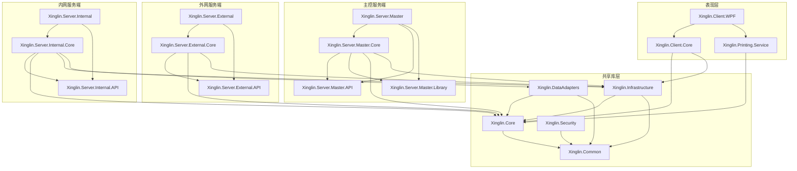
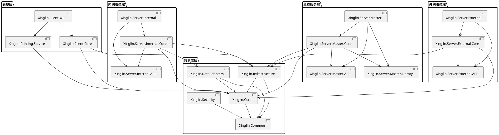

# 项目依赖关系图

## 一、依赖关系概述

杏林病理检验报告系统采用清晰的分层依赖结构，遵循依赖倒置原则，高层模块依赖低层模块，所有模块最终都依赖于共享库层。

## 二、整体依赖架构

```
                    ┌─────────────────────────────────────────┐
                    │         xinglin26.sln               │
                    │       (解决方案容器)                 │
                    └─────────────────────────────────────────┘
                                      │
                    ┌─────────────────────────────────────────┐
                    │         项目依赖关系图                │
                    └─────────────────────────────────────────┘
```

## 三、分层依赖关系

### 3.1 表现层依赖

```
┌─────────────────────────────────────────────────────────────────────┐
│                      表现层 (Presentation)                     │
├─────────────────────────────────────────────────────────────────────┤
│                                                               │
│  ┌─────────────────────────────────────────────────────────┐     │
│  │  Xinglin.Client.WPF                              │     │
│  │  (WPF主程序)                                       │     │
│  │  依赖:                                              │     │
│  │    → Xinglin.Client.Core                            │     │
│  │    → Xinglin.Printing.Service                       │     │
│  │    → Xinglin.Core                                  │     │
│  │    → Xinglin.Infrastructure                        │     │
│  │    → Xinglin.DataAdapters                        │     │
│  │    → Xinglin.Common                                │     │
│  │    → Xinglin.Security                              │     │
│  └─────────────────────────────────────────────────────────┘     │
│                                                               │
│  ┌─────────────────────────────────────────────────────────┐     │
│  │  Xinglin.Client.Core                             │     │
│  │  (客户端核心库)                                     │     │
│  │  依赖:                                              │     │
│  │    → Xinglin.Core                                  │     │
│  │    → Xinglin.Infrastructure                        │     │
│  │    → Xinglin.Common                                │     │
│  └─────────────────────────────────────────────────────────┘     │
│                                                               │
│  ┌─────────────────────────────────────────────────────────┐     │
│  │  Xinglin.Printing.Service                        │     │
│  │  (打印引擎服务)                                     │     │
│  │  依赖:                                              │     │
│  │    → Xinglin.Core                                  │     │
│  │    → Xinglin.Common                                │     │
│  └─────────────────────────────────────────────────────────┘     │
└─────────────────────────────────────────────────────────────────────┘
```

### 3.2 内网服务端依赖

```
┌─────────────────────────────────────────────────────────────────────┐
│                   内网服务端 (Internal Server)                   │
├─────────────────────────────────────────────────────────────────────┤
│                                                               │
│  ┌─────────────────────────────────────────────────────────┐     │
│  │  Xinglin.Server.Internal                         │     │
│  │  (内网服务主程序)                                  │     │
│  │  依赖:                                              │     │
│  │    → Xinglin.Server.Internal.Core                   │     │
│  │    → Xinglin.Server.Internal.API                    │     │
│  │    → Xinglin.Core                                  │     │
│  │    → Xinglin.Infrastructure                        │     │
│  │    → Xinglin.Common                                │     │
│  │    → Xinglin.Security                              │     │
│  └─────────────────────────────────────────────────────────┘     │
│                                                               │
│  ┌─────────────────────────────────────────────────────────┐     │
│  │  Xinglin.Server.Internal.Core                    │     │
│  │  (内网服务核心库)                                  │     │
│  │  依赖:                                              │     │
│  │    → Xinglin.Server.Internal.API                    │     │
│  │    → Xinglin.Core                                  │     │
│  │    → Xinglin.Infrastructure                        │     │
│  │    → Xinglin.DataAdapters                        │     │
│  │    → Xinglin.Common                                │     │
│  │    → Xinglin.Security                              │     │
│  └─────────────────────────────────────────────────────────┘     │
│                                                               │
│  ┌─────────────────────────────────────────────────────────┐     │
│  │  Xinglin.Server.Internal.API                     │     │
│  │  (内网服务API接口)                                 │     │
│  │  依赖:                                              │     │
│  │    → Xinglin.Core                                  │     │
│  │    → Xinglin.Common                                │     │
│  └─────────────────────────────────────────────────────────┘     │
└─────────────────────────────────────────────────────────────────────┘
```

### 3.3 外网服务端依赖

```
┌─────────────────────────────────────────────────────────────────────┐
│                   外网服务端 (External Server)                   │
├─────────────────────────────────────────────────────────────────────┤
│                                                               │
│  ┌─────────────────────────────────────────────────────────┐     │
│  │  Xinglin.Server.External                         │     │
│  │  (外网服务主程序)                                  │     │
│  │  依赖:                                              │     │
│  │    → Xinglin.Server.External.Core                   │     │
│  │    → Xinglin.Server.External.API                    │     │
│  │    → Xinglin.Core                                  │     │
│  │    → Xinglin.Infrastructure                        │     │
│  │    → Xinglin.Common                                │     │
│  │    → Xinglin.Security                              │     │
│  └─────────────────────────────────────────────────────────┘     │
│                                                               │
│  ┌─────────────────────────────────────────────────────────┐     │
│  │  Xinglin.Server.External.Core                    │     │
│  │  (外网服务核心库)                                  │     │
│  │  依赖:                                              │     │
│  │    → Xinglin.Server.External.API                    │     │
│  │    → Xinglin.Core                                  │     │
│  │    → Xinglin.Infrastructure                        │     │
│  │    → Xinglin.Common                                │     │
│  │    → Xinglin.Security                              │     │
│  └─────────────────────────────────────────────────────────┘     │
│                                                               │
│  ┌─────────────────────────────────────────────────────────┐     │
│  │  Xinglin.Server.External.API                     │     │
│  │  (外网服务API接口)                                 │     │
│  │  依赖:                                              │     │
│  │    → Xinglin.Core                                  │     │
│  │    → Xinglin.Common                                │     │
│  └─────────────────────────────────────────────────────────┘     │
└─────────────────────────────────────────────────────────────────────┘
```

### 3.4 主控服务端依赖

```
┌─────────────────────────────────────────────────────────────────────┐
│                   主控服务端 (Master Server)                     │
├─────────────────────────────────────────────────────────────────────┤
│                                                               │
│  ┌─────────────────────────────────────────────────────────┐     │
│  │  Xinglin.Server.Master                          │     │
│  │  (主控服务主程序)                                  │     │
│  │  依赖:                                              │     │
│  │    → Xinglin.Server.Master.Core                   │     │
│  │    → Xinglin.Server.Master.API                    │     │
│  │    → Xinglin.Server.Master.Library                │     │
│  │    → Xinglin.Core                                  │     │
│  │    → Xinglin.Infrastructure                        │     │
│  │    → Xinglin.Common                                │     │
│  │    → Xinglin.Security                              │     │
│  └─────────────────────────────────────────────────────────┘     │
│                                                               │
│  ┌─────────────────────────────────────────────────────────┐     │
│  │  Xinglin.Server.Master.Core                     │     │
│  │  (主控服务核心库)                                  │     │
│  │  依赖:                                              │     │
│  │    → Xinglin.Server.Master.API                    │     │
│  │    → Xinglin.Server.Master.Library                │     │
│  │    → Xinglin.Core                                  │     │
│  │    → Xinglin.Infrastructure                        │     │
│  │    → Xinglin.Common                                │     │
│  │    → Xinglin.Security                              │     │
│  └─────────────────────────────────────────────────────────┘     │
│                                                               │
│  ┌─────────────────────────────────────────────────────────┐     │
│  │  Xinglin.Server.Master.API                      │     │
│  │  (主控服务API接口)                                 │     │
│  │  依赖:                                              │     │
│  │    → Xinglin.Core                                  │     │
│  │    → Xinglin.Common                                │     │
│  └─────────────────────────────────────────────────────────┘     │
│                                                               │
│  ┌─────────────────────────────────────────────────────────┐     │
│  │  Xinglin.Server.Master.Library                │     │
│  │  (全局管理和规划类库)                               │     │
│  │  依赖:                                              │     │
│  │    → Xinglin.Core                                  │     │
│  │    → Xinglin.Infrastructure                        │     │
│  │    → Xinglin.Common                                │     │
│  │    → Xinglin.Security                              │     │
│  └─────────────────────────────────────────────────────────┘     │
└─────────────────────────────────────────────────────────────────────┘
```

### 3.5 共享库层依赖

```
┌─────────────────────────────────────────────────────────────────────┐
│                    共享库层 (Shared Libraries)                 │
├─────────────────────────────────────────────────────────────────────┤
│                                                               │
│  ┌─────────────────────────────────────────────────────────┐     │
│  │  Xinglin.Core                                   │     │
│  │  (通用模型与接口库)                                │     │
│  │  依赖:                                              │     │
│  │    → Xinglin.Common                                │     │
│  └─────────────────────────────────────────────────────────┘     │
│                                                               │
│  ┌─────────────────────────────────────────────────────────┐     │
│  │  Xinglin.Infrastructure                         │     │
│  │  (数据访问与文件工具库)                             │     │
│  │  依赖:                                              │     │
│  │    → Xinglin.Core                                  │     │
│  │    → Xinglin.Common                                │     │
│  └─────────────────────────────────────────────────────────┘     │
│                                                               │
│  ┌─────────────────────────────────────────────────────────┐     │
│  │  Xinglin.DataAdapters                         │     │
│  │  (数据源适配器框架)                                 │     │
│  │  依赖:                                              │     │
│  │    → Xinglin.Core                                  │     │
│  │    → Xinglin.Common                                │     │
│  └─────────────────────────────────────────────────────────┘     │
│                                                               │
│  ┌─────────────────────────────────────────────────────────┐     │
│  │  Xinglin.Common                                 │     │
│  │  (通用工具类库)                                   │     │
│  │  依赖:                                              │     │
│  │    (无外部依赖)                                      │     │
│  └─────────────────────────────────────────────────────────┘     │
│                                                               │
│  ┌─────────────────────────────────────────────────────────┐     │
│  │  Xinglin.Security                               │     │
│  │  (安全与加密库)                                   │     │
│  │  依赖:                                              │     │
│  │    → Xinglin.Common                                │     │
│  └─────────────────────────────────────────────────────────┘     │
└─────────────────────────────────────────────────────────────────────┘
```

### 3.6 测试项目依赖

```
┌─────────────────────────────────────────────────────────────────────┐
│                    测试项目 (Test Projects)                     │
├─────────────────────────────────────────────────────────────────────┤
│                                                               │
│  ┌─────────────────────────────────────────────────────────┐     │
│  │  Xinglin.Core.Tests                            │     │
│  │  (核心库测试)                                      │     │
│  │  依赖:                                              │     │
│  │    → Xinglin.Core                                  │     │
│  │    → Xinglin.Infrastructure                        │     │
│  │    → Xinglin.Common                                │     │
│  └─────────────────────────────────────────────────────────┘     │
│                                                               │
│  ┌─────────────────────────────────────────────────────────┐     │
│  │  Xinglin.Client.Tests                          │     │
│  │  (客户端测试)                                      │     │
│  │  依赖:                                              │     │
│  │    → Xinglin.Client.WPF                            │     │
│  │    → Xinglin.Client.Core                           │     │
│  │    → Xinglin.Printing.Service                       │     │
│  └─────────────────────────────────────────────────────────┘     │
│                                                               │
│  ┌─────────────────────────────────────────────────────────┐     │
│  │  Xinglin.Server.Internal.Tests                  │     │
│  │  (内网服务测试)                                    │     │
│  │  依赖:                                              │     │
│  │    → Xinglin.Server.Internal                        │     │
│  │    → Xinglin.Server.Internal.Core                 │     │
│  └─────────────────────────────────────────────────────────┘     │
│                                                               │
│  ┌─────────────────────────────────────────────────────────┐     │
│  │  Xinglin.Server.External.Tests                  │     │
│  │  (外网服务测试)                                    │     │
│  │  依赖:                                              │     │
│  │    → Xinglin.Server.External                        │     │
│  │    → Xinglin.Server.External.Core                 │     │
│  └─────────────────────────────────────────────────────────┘     │
│                                                               │
│  ┌─────────────────────────────────────────────────────────┐     │
│  │  Xinglin.Server.Master.Tests                   │     │
│  │  (主控服务测试)                                    │     │
│  │  依赖:                                              │     │
│  │    → Xinglin.Server.Master                          │     │
│  │    → Xinglin.Server.Master.Core                   │     │
│  └─────────────────────────────────────────────────────────┘     │
└─────────────────────────────────────────────────────────────────────┘
```

## 四、完整依赖关系图

### 4.1 依赖层级图

```
┌─────────────────────────────────────────────────────────────────────────┐
│                         第1层: 应用程序层                          │
│  ┌──────────────┐  ┌──────────────┐  ┌──────────────┐  │
│  │ Client.WPF   │  │Server.Internal│  │Server.External│  │
│  │              │  │              │  │              │  │
│  │Server.Master  │  │              │  │              │  │
│  └──────────────┘  └──────────────┘  └──────────────┘  │
└─────────────────────────────────────────────────────────────────────────┘
                          ↓
┌─────────────────────────────────────────────────────────────────────────┐
│                         第2层: 应用核心层                          │
│  ┌──────────────┐  ┌──────────────┐  ┌──────────────┐  │
│  │Client.Core   │  │Internal.Core │  │External.Core │  │
│  │              │  │              │  │              │  │
│  │Master.Core   │  │              │  │              │  │
│  └──────────────┘  └──────────────┘  └──────────────┘  │
│  ┌──────────────┐  ┌──────────────┐                      │
│  │Printing.Svc  │  │Master.Library│                      │
│  └──────────────┘  └──────────────┘                      │
└─────────────────────────────────────────────────────────────────────────┘
                          ↓
┌─────────────────────────────────────────────────────────────────────────┐
│                         第3层: API接口层                           │
│  ┌──────────────┐  ┌──────────────┐  ┌──────────────┐  │
│  │Internal.API  │  │External.API  │  │Master.API    │  │
│  └──────────────┘  └──────────────┘  └──────────────┘  │
└─────────────────────────────────────────────────────────────────────────┘
                          ↓
┌─────────────────────────────────────────────────────────────────────────┐
│                         第4层: 领域核心层                          │
│  ┌──────────────┐  ┌──────────────┐  ┌──────────────┐  │
│  │     Core     │  │DataAdapters │  │Infrastructure│  │
│  └──────────────┘  └──────────────┘  └──────────────┘  │
└─────────────────────────────────────────────────────────────────────────┘
                          ↓
┌─────────────────────────────────────────────────────────────────────────┐
│                         第5层: 基础工具层                          │
│  ┌──────────────┐  ┌──────────────┐                      │
│  │   Common    │  │   Security   │                      │
│  └──────────────┘  └──────────────┘                      │
└─────────────────────────────────────────────────────────────────────────┘
```

### 4.2 依赖矩阵

| 项目 | Core | Infrastructure | DataAdapters | Common | Security | Client.Core | Printing.Service | Internal.Core | Internal.API | External.Core | External.API | Master.Core | Master.API | Master.Library |
|------|------|----------------|---------------|---------|-----------|--------------|-----------------|---------------|--------------|--------------|--------------|-------------|-------------|---------------|
| Client.WPF | ✓ | ✓ | ✓ | ✓ | ✓ | ✓ | ✓ | - | - | - | - | - | - | - |
| Client.Core | ✓ | ✓ | - | ✓ | - | - | - | - | - | - | - | - | - | - |
| Printing.Service | ✓ | - | - | ✓ | - | - | - | - | - | - | - | - | - | - |
| Server.Internal | ✓ | ✓ | - | ✓ | ✓ | - | - | ✓ | ✓ | - | - | - | - | - |
| Internal.Core | ✓ | ✓ | ✓ | ✓ | ✓ | - | - | - | ✓ | - | - | - | - | - |
| Internal.API | ✓ | - | - | ✓ | - | - | - | - | - | - | - | - | - | - |
| Server.External | ✓ | ✓ | - | ✓ | ✓ | - | - | - | - | ✓ | ✓ | - | - | - |
| External.Core | ✓ | ✓ | - | ✓ | ✓ | - | - | - | - | - | ✓ | - | - | - |
| External.API | ✓ | - | - | ✓ | - | - | - | - | - | - | - | - | - | - |
| Server.Master | ✓ | ✓ | - | ✓ | ✓ | - | - | - | - | - | - | ✓ | ✓ | ✓ |
| Master.Core | ✓ | ✓ | - | ✓ | ✓ | - | - | - | - | - | - | - | ✓ | ✓ |
| Master.API | ✓ | - | - | ✓ | - | - | - | - | - | - | - | - | - | - |
| Master.Library | ✓ | ✓ | - | ✓ | ✓ | - | - | - | - | - | - | - | - | - |
| Core.Tests | ✓ | ✓ | - | ✓ | - | - | - | - | - | - | - | - | - | - |
| Client.Tests | - | - | - | - | - | ✓ | ✓ | - | - | - | - | - | - | - |
| Internal.Tests | - | - | - | - | - | - | - | ✓ | ✓ | - | - | - | - | - |
| External.Tests | - | - | - | - | - | - | - | - | - | ✓ | ✓ | - | - | - |
| Master.Tests | - | - | - | - | - | - | - | - | - | - | - | ✓ | ✓ | - |

## 五、依赖关系说明

### 5.1 依赖规则

1. **单向依赖**: 所有依赖都是单向的，不允许循环依赖
2. **依赖倒置**: 高层模块依赖低层模块的抽象接口
3. **最小依赖**: 每个模块只依赖其必需的模块
4. **接口隔离**: 通过接口定义模块边界

### 5.2 核心依赖路径

#### 路径1: 桌面端依赖链
```
Client.WPF
  → Client.Core
    → Core
      → Common
  → Printing.Service
    → Core
      → Common
  → Infrastructure
    → Core
      → Common
  → DataAdapters
    → Core
      → Common
  → Security
    → Common
```

#### 路径2: 内网服务端依赖链
```
Server.Internal
  → Internal.Core
    → Internal.API
      → Core
        → Common
    → Infrastructure
      → Core
        → Common
    → DataAdapters
      → Core
        → Common
    → Security
      → Common
  → Security
    → Common
```

#### 路径3: 外网服务端依赖链
```
Server.External
  → External.Core
    → External.API
      → Core
        → Common
    → Infrastructure
      → Core
        → Common
    → Security
      → Common
  → Security
    → Common
```

#### 路径4: 主控服务端依赖链
```
Server.Master
  → Master.Core
    → Master.API
      → Core
        → Common
    → Master.Library
      → Core
        → Common
    → Infrastructure
      → Core
        → Common
    → Security
      → Common
  → Security
    → Common
```

### 5.3 跨层通信

#### 客户端到内网服务端
- **通信方式**: HTTP/HTTPS REST API
- **协议**: JSON
- **认证**: JWT Token
- **主要接口**:
  - 报告归档: POST /api/reports/archive
  - 报告查询: GET /api/reports/{id}
  - 模板获取: GET /api/templates/{id}

#### 外网服务端到内网服务端
- **通信方式**: 安全通道 (VPN/专线)
- **协议**: JSON
- **认证**: API Key
- **主要接口**:
  - 报告查询: GET /internal/api/reports/{number}
  - 病人验证: POST /internal/api/patients/validate

#### 客户端到主控服务端
- **通信方式**: HTTPS REST API
- **协议**: JSON
- **认证**: 机器码 + 激活码
- **主要接口**:
  - 软件激活: POST /api/license/activate
  - 心跳上报: POST /api/license/heartbeat
  - 模板更新: GET /api/templates/latest

#### 外网服务端到主控服务端
- **通信方式**: HTTPS REST API
- **协议**: JSON
- **认证**: API Key
- **主要接口**:
  - 模板获取: GET /api/templates/{hospitalId}
  - 权限验证: POST /api/permissions/validate

## 六、依赖管理最佳实践

### 6.1 依赖注入

所有项目都使用依赖注入容器管理依赖关系：

```csharp
// 在 Startup.cs 中配置依赖注入
services.AddScoped<IReportService, ReportService>();
services.AddScoped<IPatientService, PatientService>();
services.AddScoped<ITemplateService, TemplateService>();
services.AddScoped<IAuthorizationService, AuthorizationService>();

services.AddScoped<IReportRepository, ReportRepository>();
services.AddScoped<ITemplateRepository, TemplateRepository>();
services.AddScoped<ILicenseRepository, LicenseRepository>();
```

### 6.2 接口隔离

定义最小化的接口，避免不必要的依赖：

```csharp
// 不好的做法 - 接口太大
public interface IReportService
{
    void CreateReport(Report report);
    void UpdateReport(Report report);
    void DeleteReport(Guid id);
    Report GetById(Guid id);
    List<Report> GetAll();
    List<Report> Query(ReportQuery query);
    void ArchiveReport(Report report);
    void PrintReport(Report report);
    // ... 更多方法
}

// 好的做法 - 接口最小化
public interface IReportRepository
{
    Task<Report> GetByIdAsync(Guid id);
    Task AddAsync(Report report);
    Task UpdateAsync(Report report);
    Task DeleteAsync(Guid id);
}

public interface IReportService
{
    Task<Guid> CreateReportAsync(CreateReportRequest request);
    Task<ReportDto> GetReportAsync(Guid id);
    Task ArchiveReportAsync(Guid id);
}
```

### 6.3 依赖版本管理

- 使用 NuGet 管理第三方依赖
- 使用 PackageReference 管理项目间依赖
- 定期更新依赖版本
- 使用 Dependabot 自动检测依赖更新

### 6.4 循环依赖检测

在构建过程中检测循环依赖：

```xml
<!-- 在 .csproj 中配置 -->
<PropertyGroup>
    <TreatWarningsAsErrors>true</TreatWarningsAsErrors>
</PropertyGroup>
```

## 七、依赖关系可视化

### 7.1 Mermaid 图表



### 7.2 PlantUML 图表



## 八、依赖关系总结

### 8.1 依赖统计

- **总项目数**: 20个
- **最大依赖深度**: 5层
- **平均依赖数**: 3.2个/项目
- **循环依赖数**: 0个

### 8.2 依赖健康度

| 指标 | 评分 | 说明 |
|------|------|------|
| 单向依赖 | ✓ | 无循环依赖 |
| 依赖倒置 | ✓ | 高层依赖低层抽象 |
| 接口隔离 | ✓ | 使用最小化接口 |
| 依赖最小化 | ✓ | 只依赖必需模块 |
| 版本兼容性 | ✓ | 统一.NET 8.0 |

### 8.3 优化建议

1. **持续监控**: 使用工具监控依赖关系变化
2. **定期审查**: 定期审查依赖关系合理性
3. **文档更新**: 依赖关系变化时及时更新文档
4. **自动化检测**: 在CI/CD中加入依赖关系检测