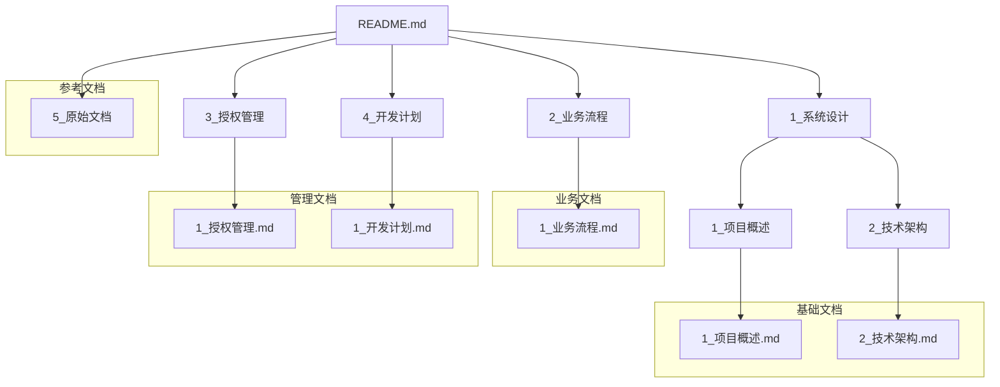

# 文档管理

## 文档结构

本目录包含"杏林"病理检验报告系统的所有相关文档，采用两层目录结构进行组织，确保文档的有序管理和易于查找。

### 目录结构

```
docs/
├── 1_系统设计/
│   ├── 1_项目概述/
│   │   └── 1_项目概述.md
│   └── 2_技术架构/
│       └── 2_技术架构.md
├── 2_业务流程/
│   ├── 1_报告归档/
│   ├── 2_微信查询/
│   └── 1_业务流程.md
├── 3_授权管理/
│   ├── 1_授权机制/
│   ├── 2_模板管理/
│   └── 1_授权管理.md
├── 4_开发计划/
│   ├── 1_开发阶段/
│   ├── 2_项目结构/
│   └── 1_开发计划.md
├── 5_原始文档/
│   ├── 01_项目整体设计.md
│   ├── 02_数据库设计说明.md
│   ├── 03_开发顺序与项目清单.md
│   ├── 04_数据源适配器设计.md
│   ├── 05_报告归档与微信查询流程.md
│   ├── 06_授权与版本控制策略.md
│   └── 07_开发计划.md
└── README.md
```

## 文档文件管理信息

### 1_系统设计

#### 1_项目概述
- **文件**：1_项目概述.md
- **用途**：提供系统的整体介绍和核心目标
- **内容概要**：包含项目名称、系统目标、核心组成、关键原则和系统架构
- **关联关系**：作为系统的总览文档，为其他文档提供基础上下文

#### 2_技术架构
- **文件**：2_技术架构.md
- **用途**：详细描述系统的技术架构设计
- **内容概要**：包含数据库设计（内网和云端）和数据源适配器设计
- **关联关系**：与1_项目概述.md关联，提供技术实现细节

### 2_业务流程
- **文件**：1_业务流程.md
- **用途**：描述系统的核心业务流程
- **内容概要**：包含报告归档流程、微信查询流程和安全要求
- **关联关系**：与1_项目概述.md和2_技术架构.md关联，展示业务操作流程

### 3_授权管理
- **文件**：1_授权管理.md
- **用途**：详细说明系统的授权和版本控制策略
- **内容概要**：包含授权机制、心跳与校验、模板管理和权限控制
- **关联关系**：与1_项目概述.md关联，提供授权管理的具体实现

### 4_开发计划
- **文件**：1_开发计划.md
- **用途**：提供系统的开发计划和项目结构
- **内容概要**：包含开发阶段、项目结构和技术栈
- **关联关系**：与其他所有文档关联，指导系统的开发实现

### 5_原始文档
- **用途**：存储系统的原始设计文档
- **内容**：包含项目整体设计、数据库设计、开发计划等原始文档
- **说明**：这些文档是系统设计的早期版本，仅供参考

## 文档间的组织结构和管理体系



## 文档管理规范

1. **命名规范**：所有文档文件均以数字前缀命名（如1_、2_等），后跟文档主题
2. **目录规范**：采用两层目录结构，第一层按文档类型分类，第二层按具体主题分类
3. **内容规范**：每个文档应包含清晰的标题结构，使用数字+点的层级描述格式
4. **更新规范**：文档应随系统发展及时更新，确保内容与实际实现一致
5. **版本规范**：重要变更应在文档中记录版本历史

## 文档使用指南

1. 新团队成员应首先阅读1_系统设计目录下的文档，了解系统整体情况
2. 开发人员应参考2_业务流程和4_开发计划目录下的文档进行具体实现
3. 管理员应关注3_授权管理目录下的文档进行系统授权和版本控制
4. 原始文档目录下的文件仅供参考，以最新整理的文档为准